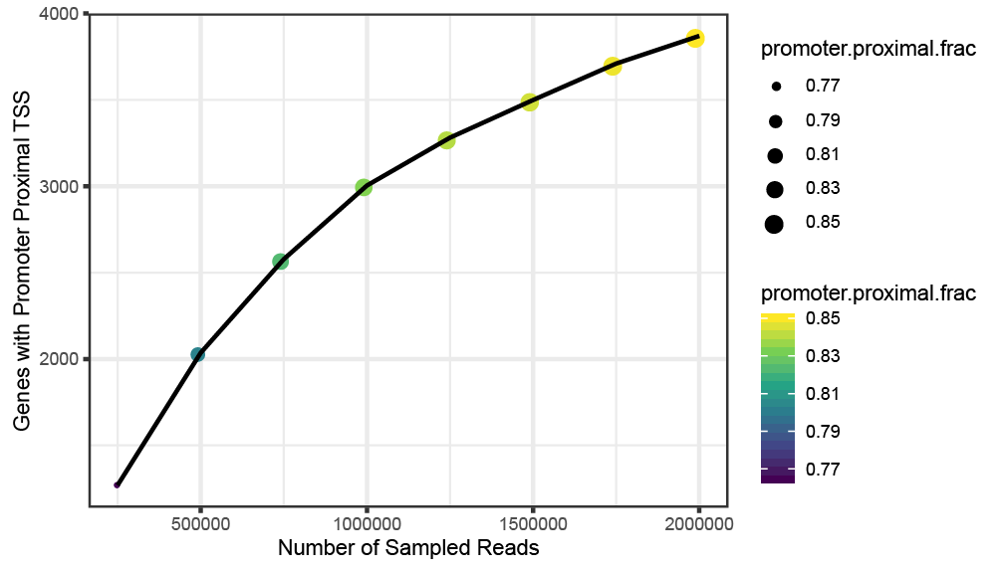

# STRIPE-seq Sequencing Saturation.

v1.0.0

This repository leverages the convenience of singularity containers to allow the sequencing saturation analysis of STRIPE-seq data.
First, the provided BAM file derived from STRIPE-seq is downsampled in user defined increments.
Then for each downsampled BAM, the number of genes detected with promoter proximal TSSs is reported, along with the total fraction of unique TSSs that are promoter proximal. 
Finally, the results are plotted for easy visualization.



# Getting Started

## Cloning Repository

To get started, you must first clone the STRIPE-seq sequencing saturation repository.
Navigate to a directory you would like to clone the repository to and enter
```
git clone https://github.com/rpolicastro/stripe_saturation.git
```

## Installing Singularity

Singularity containers are self contained 'boxes' that house the software and other files necessary for the workflow. 
The container itself will automatically be downloaded, but you must have the Singularity software installed to both download and use the container. 
Please refer to the [documentation](https://www.sylabs.io/docs/) on their website.

## Specifying Run Settings

The last step is to set a few settings in the 'settings.conf' file and place it in the main repository directory. An example settings file is provided in the 'docs' directory of the repository for you to copy.

| Setting | Description |
| ------- | ----------- |
| CORES | Available CPU cores/threads. |
| BAM | Directory and file name of BAM file. |
| PAIRED | (TRUE/FALSE) Whether the BAM is paired end. |
| GTF | Direcotry and file name of genome annotation file. |
| OUTDIR | Directory to output results. |
| FROM | The number of reads to start sampling from. |
| TO | The number of reads to sample to. |
| BY | Sampling interval. |

Please note that your 'TO' value should be less than the total number of fragments in your 'BAM' file. The 'BY' value should also be a multiple of your 'FROM' and 'TO' values.

## Running the Workflow

After getting Singularity installed and the settings specified, you are now ready to run the workflow. Navigate to the main directory and enter 'bash RUN.sh'.

# Built With

This workflow would not be possible without the great software listed below.

- [Samtools](http://www.htslib.org/) - SAM/BAM manipulation.
- [Tidyverse](https://www.tidyverse.org/) - Collection of data science packages for R.
- [Bioconductor](https://www.bioconductor.org/) - Collection of R libraries for biological data science.
- [ChIPseeker](https://bioconductor.org/packages/release/bioc/html/ChIPseeker.html) - Convenient annotation of genomic ranges.
- [TSRchitect](https://bioconductor.org/packages/release/bioc/html/TSRchitect.html) - TSS analysis of 5' mapping data.
